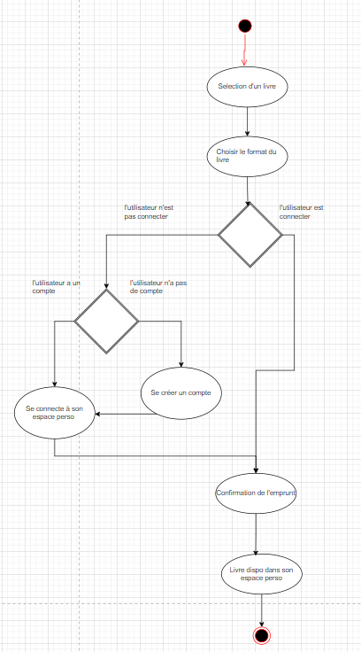

# Bibliomaniac

## Contexte des Tâches Réalisées

Durant le projet de refonte de l’application **Bibliomaniac**, plusieurs étapes ont été accomplies pour parvenir à une version améliorée de l'interface. Chaque tâche a permis de découvrir et de maîtriser de nouveaux outils et concepts qui ont été mis en œuvre dans les différentes phases du projet.

### 1. Découverte de Figma

Au début du projet, nous avons exploré **Figma**, un outil de design et de prototypage collaboratif, essentiel pour la conception de l’interface utilisateur. Cette découverte nous a permis de comprendre comment :

- Créer des **maquettes interactives** et simuler la navigation entre les différents écrans.
- Organiser les **calques et composants** de manière structurée pour faciliter la lisibilité et les modifications futures.
- Utiliser les **fonctions de prototypage** pour simuler des transitions et interactions, améliorant ainsi la fluidité de la navigation.

Cette étape a été cruciale pour maîtriser la création de **maquettes interactives** et la gestion des interfaces complexes.

### 2. Création des maquettes et des déclinaisons Desktop

Après la phase de découverte, nous avons recréé les **six écrans de l’application** tout en assurant une navigation fluide. Les principales étapes de cette tâche incluaient :

- **Adapter les interfaces pour les utilisateurs de bibliothèques** tout en respectant les principes d’ergonomie et d’esthétique.
- **Décliner deux écrans pour une version desktop**, prenant en compte les différences de résolutions et de dispositifs, et optimisant l’agencement des informations pour un usage sur écran plus large.

Cette tâche nous a permis de pratiquer la conception **multi-supports** en ajustant l'interface selon les besoins spécifiques des utilisateurs.

### 3. Découverte du Diagramme d'Activité

Nous avons ensuite découvert la **modélisation des parcours utilisateurs** sous forme de **diagramme d’activité**. Cela nous a aidés à comprendre et à représenter :

- Les différentes étapes qu’un utilisateur suit pour emprunter un livre, depuis la recherche dans le catalogue jusqu'à la confirmation de l'emprunt.
- Les **interactions entre les systèmes** et les utilisateurs, visualisant les décisions ou actions à chaque étape.
- L'importance de cartographier le **flux d’activité** afin d'optimiser l’expérience utilisateur.

Cette tâche nous a permis de modéliser de façon claire et compréhensible les **parcours utilisateurs** afin de garantir une navigation intuitive.

### 4. Optimisation de l'accessibilité (RGAA)

Nous avons également découvert et appliqué les **principes du RGAA (Référentiel Général d’Amélioration de l’Accessibilité)**. Cette tâche a consisté à :

- **Auditer l’accessibilité d’un écran** selon les critères du RGAA (couleurs, contrastes, textes alternatifs pour les images, navigation clavier, etc.).
- Optimiser l'écran en fonction des **besoins spécifiques des utilisateurs** en situation de handicap (visuel, auditif ou moteur).
- Assurer que l’application respecte les **normes d’accessibilité**, rendant ainsi l’interface plus inclusive et conforme aux standards en vigueur.

### 5. Gestion de projet et collaboration

Le projet a également été une opportunité pour travailler en binôme. Nous avons découvert et appliqué des méthodes de :

- **Répartition des tâches** : Chaque membre a pris en charge certaines parties du projet (par exemple, la création des maquettes pour certains écrans, la modélisation du diagramme, l'optimisation de l'accessibilité, etc.).
- **Suivi de projet et coordination** : Nous avons utilisé des outils de gestion de projet pour suivre l’avancement de chaque tâche et communiquer de façon fluide entre nous.
- **Organisation des fichiers** dans Figma pour faciliter la collaboration et garantir la lisibilité pour d'éventuels futurs contributeurs.

### 6. Utilisation de ressources libres de droits

Enfin, nous avons veillé à n'utiliser que des **ressources libres de droits** (images, icônes, typographies) pour garantir la conformité du projet. Cette tâche a impliqué :

- La recherche et la sélection d’**assets compatibles** avec notre charte graphique.
- La gestion des licences et la vérification de la légalité des ressources utilisées.

Cette démarche a permis d'assurer que tous les contenus sont conformes aux exigences légales.

## Livrables

[Lien Figma](https://www.figma.com/design/vJbbjb1nPZGQkuLGCVSzEz/Untitled?node-id=1-21&t=TbV5NNCbXXMwD7xT-1)\
[Lien diagramme d'activité UML](https://drive.google.com/file/d/1zJlxtr9gfBniWV_AeeRD9TQb2jkRxkrE/view?usp=sharing)\

